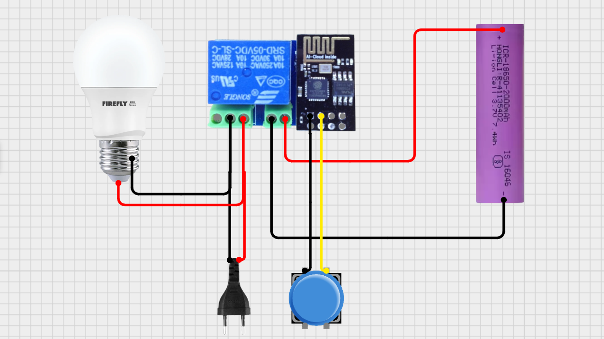
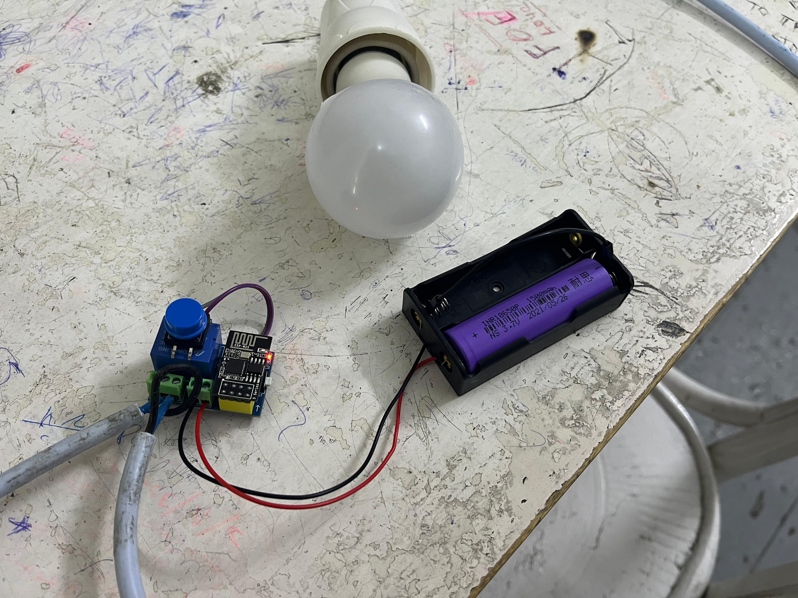
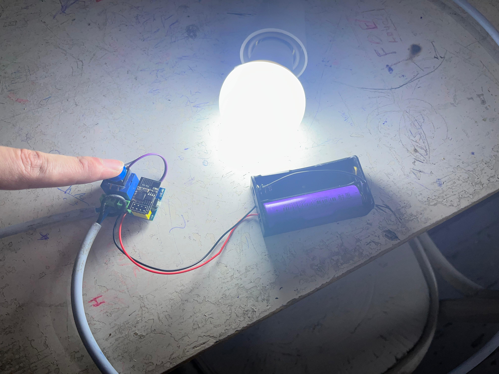

# Smart Switch

The **Smart Switch** system enables remote and local control of AC-powered appliances—such as lamps—via multiple user interfaces, including a mobile app, website dashboard, Smart Ring, and a physical pushbutton. Designed for portability and user convenience, it integrates both hardware and software components to provide seamless IoT-based control.

---

## 📸 Images

| Smart Switch Circuit | Prototype (OFF) | Prototype (ON) |
|----------------------|------------------|-----------------|
|  |  |  |

> ⚠️ Replace the paths in the table above (`images/*.jpg`) with the actual paths or upload the images accordingly.

---

## 📌 Use Case

The **Smart Switch** is built to provide flexible control over home appliances. Users can:

- Turn the device on/off remotely via a **mobile application**.
- Access and control the device via a **website dashboard**.
- Use a **Smart Ring** to trigger actions through gestures.
- Operate the switch manually using a **physical pushbutton**.

This design ensures accessibility in various situations—from smart home setups to manual intervention in case of internet failure.

---

## 🛠️ Hardware Components and Justification

| Component                     | Description                                                                 |
|------------------------------|-----------------------------------------------------------------------------|
| ESP-01S Relay Module          | Handles Wi-Fi connectivity and switching logic.                            |
| Pushbutton (GPIO2)            | Provides local manual override control.                                    |
| 3.7V 18650 Li-ion Battery     | Ensures portability and reliable low-power operation.                      |
| AC-Powered Lamp               | Target appliance controlled by the relay module.                           |
| AC Plug                       | Supplies power to the lamp via the relay-controlled circuit.               |

---

## 💻 Software Overview

- **Language**: C++  
- **Development Environment**: Arduino IDE  
- **Cloud Platform**: Firebase  
- **Library Used**: [Firebase ESP Client Library](https://github.com/mobizt/Firebase-ESP-Client)  

The ESP-01S is programmed to:
- Communicate with Firebase in real-time.
- Respond to commands from the mobile app or website.
- Control the state of the relay.
- Read pushbutton input for manual switching.

---

## 🚀 Features

- 🔌 Control via **App**, **Website**, **Smart Ring**, or **Manual Button**
- 📶 Real-time **Firebase** synchronization
- 🔋 **Battery-powered** for portability
- 🔒 Safe **AC switching** through relay isolation
- 🧠 **IoT-ready** and customizable firmware

---

## 🧪 Future Improvements

- Add feedback mechanism (e.g., LED status indicators)
- Integrate voice control (e.g., with Google Assistant)
- Enable energy monitoring features

---

## 👤 Developed By

Mohamed Mostafa  
**IoT Engineer**  

